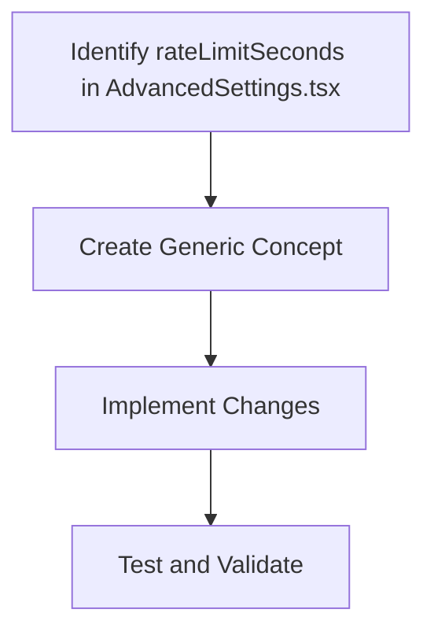

# Concept for Deactivating `rateLimitSeconds` Based on API Handlers

## Overview

This concept outlines a generic approach to deactivate specific settings based on the API handler being used. The goal is to create a reusable function that can be applied to different handlers. This includes the integration of the `RateLimitHandler` class to manage rate limits directly using the Mistral SDK.

## Steps

1. **Identify the Relevant Code**

    - Locate the `rateLimitSeconds` setting in the `AdvancedSettings.tsx` file.
    - Understand how it is used and updated.

2. **Create a Generic Concept**

    - Develop a function or utility that can deactivate a specific setting based on the handler's requirements.
    - The function should take the setting name and handler name as parameters.

3. **Implement the Changes**

    - Modify the `AdvancedSettings` component to use the new function.
    - Ensure the function is called when a handler like Mistral is used.

4. **Test and Validate**

    - Write unit tests to ensure the function works as expected.
    - Test the changes with different handlers to ensure they are applied correctly.

## Mermaid Diagram



## Detailed Plan

### Step 1: Identify the Relevant Code

- **File**: `webview-ui/src/components/settings/AdvancedSettings.tsx`
- **Lines**:
    - `rateLimitSeconds` is defined as a prop in `AdvancedSettingsProps`.
    - It is used in the range input for the rate limit setting.

### Step 2: Create a Generic Concept

- **Concept**:

    - Create a function or utility that can deactivate a specific setting based on the handler's requirements.
    - The function should take the setting name and handler name as parameters.

- **Example**:
    ```typescript
    function deactivateSetting(settingName: string, handlerName: string) {
    	// Logic to deactivate the setting
    }
    ```

### Step 3: Implement the Changes

- **Changes**:

    - Modify the `AdvancedSettings` component to use the new function.
    - Ensure the function is called when a handler like Mistral is used.

- **Example**:
    ```typescript
    // In AdvancedSettings.tsx
    if (handlerName === "mistral") {
    	deactivateSetting("rateLimitSeconds", "mistral")
    }
    ```

### Step 4: Test and Validate

- **Testing**:

    - Write unit tests to ensure the function works as expected.
    - Test the changes with different handlers to ensure they are applied correctly.

- **Validation**:

    - Validate the changes in a development environment.
    - Ensure the changes do not affect other settings or handlers.

## RateLimitHandler Class as a separate file

The `RateLimitHandler` class is designed to manage rate limits directly using the Mistral SDK. It includes methods to execute requests with rate limiting, update rate limit information, and handle rate limit errors.

```typescript
class RateLimitHandler {
	private remainingRequests: number = 100 // Initial assumption
	private maxRequests: number = 100 // Initial assumption

	async executeWithRateLimit(requestFn: () => Promise<any>) {
		// Calculate how close we are to the limit (0-1 scale)
		const limitProximity = 1 - this.remainingRequests / this.maxRequests

		// If we're close to the limit, add progressive delay
		if (limitProximity > 0.5) {
			const delayMs = Math.floor(limitProximity * 1000) // Up to 1 second delay
			await new Promise((resolve) => setTimeout(resolve, delayMs))
		}

		try {
			const response = await requestFn()
			// Update our understanding of the rate limits
			this.updateRateLimitInfo(response)
			return response
		} catch (error) {
			if (this.isRateLimitError(error)) {
				const retryAfter = this.getRetryAfterTime(error)
				await new Promise((resolve) => setTimeout(resolve, retryAfter * 1000))
				return this.executeWithRateLimit(requestFn)
			}
			throw error
		}
	}

	// Implementation details for these methods would depend on the specific SDK
	private updateRateLimitInfo(response: any) {
		/* ... */
	}
	private isRateLimitError(error: any): boolean {
		/* ... */
	}
	private getRetryAfterTime(error: any): number {
		/* ... */
	}
}
```

## Integration with Mistral SDK

To integrate the `RateLimitHandler` with the Mistral SDK, you can follow these steps:

1. **Read the Mistral SDK Documentation**:

    - Understand how to use the Mistral SDK for rate limiting.
    - Identify the methods and properties related to rate limiting.

2. **Implement the RateLimitHandler Methods**:

    - Implement the `updateRateLimitInfo`, `isRateLimitError`, and `getRetryAfterTime` methods based on the Mistral SDK documentation.

3. **Use the RateLimitHandler in the Mistral Provider**:

    - Modify the Mistral provider to use the `RateLimitHandler` for executing requests.

## Example Integration

```typescript
// In mistral.ts
import { RateLimitHandler } from "./RateLimitHandler"

const rateLimitHandler = new RateLimitHandler()

async function executeMistralRequest(requestFn: () => Promise<any>) {
	return rateLimitHandler.executeWithRateLimit(requestFn)
}

// Usage
async function fetchData() {
	const response = await executeMistralRequest(() => mistralSDK.fetchData())
	// Handle response
}
```

## Testing

- Write unit tests to ensure the `RateLimitHandler` works as expected.
- Test the changes with different handlers to ensure they are applied correctly.

## Validation

- Validate the changes in a development environment.
- Ensure the changes do not affect other settings or handlers.
